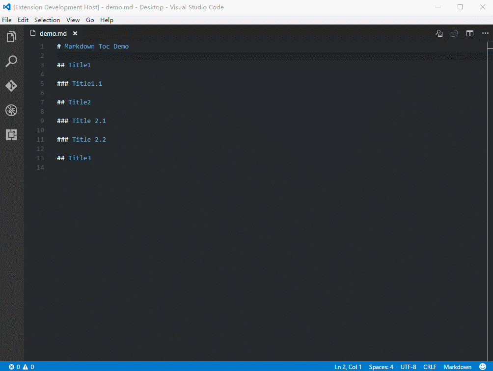
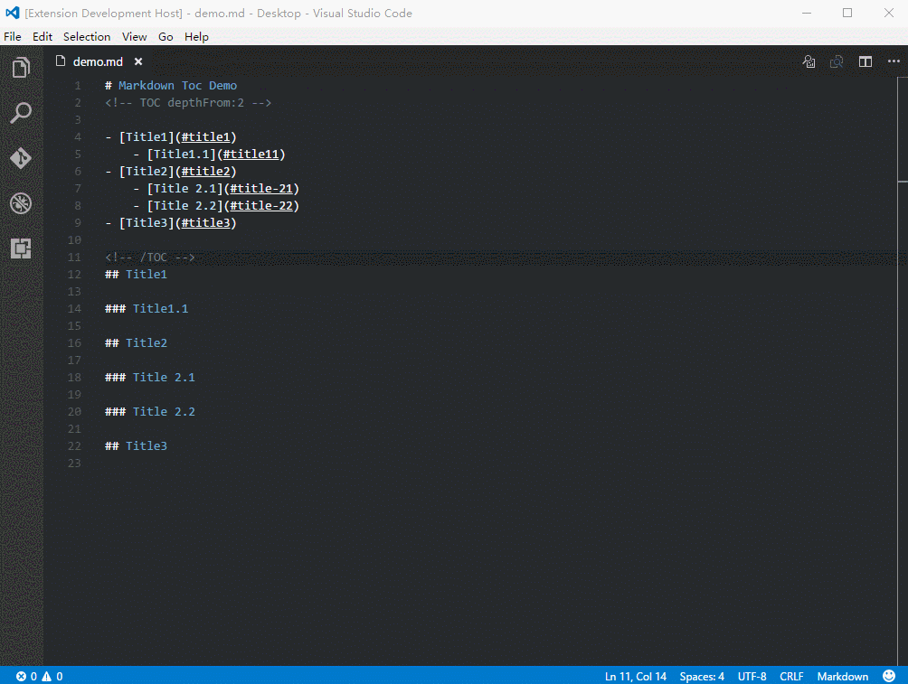

# Markdown-TOC
Generate TOC (table of contents) of headlines from parsed [markdown](https://en.wikipedia.org/wiki/Markdown) file.

<!-- TOC depthFrom:2 -->

- [1. Features](#1-features)
- [2. Installation](#2-installation)
- [3. Usage](#3-usage)
    - [3.1. Insert TOC](#31-insert-toc)
    - [3.2. Insert Header Number Sections](#32-insert-header-number-sections)
- [4. Configuration](#4-configuration)
    - [4.1. Default Settings](#41-default-settings)
    - [4.2. Unique Settings](#42-unique-settings)
- [5. Contributors](#5-contributors)
- [6. What's New?](#6-whats-new)
- [7. Question](#7-question)
- [8. License](#8-license)
- [9. Links](#9-links)

<!-- /TOC -->

## 1. Features
- Insert header number sections.
- Auto active plugin on markdown
- Insert anchor for header `<a id="markdown-header" name="header"></a>`
- Linking via anchor tags `# A 1` → `#a-1`
- Depth control[1-6] with `depthFrom:1` and `depthTo:6`
- Enable or disable links with `withLinks:true`
- Refresh list on save with `updateOnSave:true`
- Use ordered list (1. ..., 2. ...) with `orderedList:true`
- Anchor support for (github.com|nodejs.org|bitbucket.org|ghost.org|gitlab.com).

## 2. Installation
```
ext install markdown-toc
```

## 3. Usage
### 3.1. Insert TOC


### 3.2. Insert Header Number Sections
**Tips:Section of header is begin with depthFrom**



## 4. Configuration
|attributes|values|defaults|
|---|---|---|
|depthFrom|uint(1-6)|1|
|depthTo|uint(1-6)|6|
|insertAnchor|bool|false|
|withLinks|bool|true|
|orderedList|bool|false|
|updateOnSave|bool|true|
|anchorMode|github.com/bitbucket.org/ghost.org/gitlab.com|github.com|

### 4.1. Default Settings
To change the default configuration settings for the Markdown-TOC extension, edit the user or workspace settings as described here. The available settings are as follows:

|attributes|values|defaults|
|---|---|---|
|markdown-toc.depthFrom|number(1-6)|1|
|markdown-toc.depthTo|number(1-6)|6|
|markdown-toc.insertAnchor|bool|false|
|markdown-toc.withLinks|bool|true|
|markdown-toc.orderedList|bool|false|
|markdown-toc.updateOnSave|bool|true|
|markdown-toc.anchorMode|enum|github.com|

### 4.2. Unique Settings
If you want to use a unique setting for a file, you can add attributes to `<!-- TOC -->` , just like:
```
<!-- TOC depthFrom:2 orderedList:true -->

<!-- /TOC -->
```

## 5. Contributors
- sine sawtooth (Add: Header number section)
- chriscamicas (Update: Anchor generation)
- kevindaub (Add : Use workspace settings for tabs and eOL)
- rovest (Feature: Insert anchor)
- zhiguang Wang(Fix: Recognised code to header list)
- jgroom33 (Fix: Codeblock error)
- satokaz (Fix: Codeblock error)

## 6. What's New?
[CHANGELOG](https://github.com/AlanWalk/Markdown-TOC/blob/master/CHANGELOG.md)

## 7. Question
If you have any question, you can contact with me: 
- Mail : [alanwalk93@gmail.com](mailto:alanwalk93@gmail.com)
- Twitter : [@AlanWalk93](https://twitter.com/AlanWalk93)
- Github : [AlanWalk](https://github.com/AlanWalk)

## 8. License
The package is Open Source Software released under the [License](Liscense). It's developed by AlanWalk.

## 9. Links
- [Source Code](https://github.com/AlanWalk/Markdown-TOC)
- [Market](https://marketplace.visualstudio.com/items/AlanWalk.markdown-toc)
